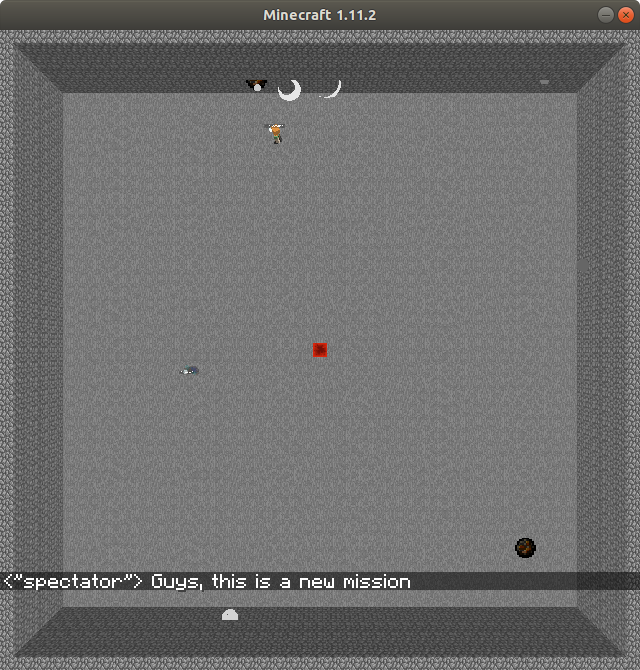
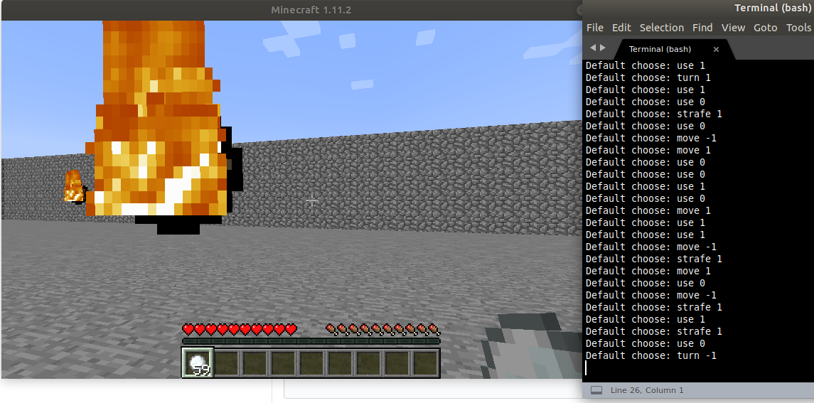

## Video:

<!-- blank line -->

<!-- blank line -->
  
## Project Summary
Our project is around a Minecraft fireball battle game that we developed. We configured the game ourselves following our own imaginations and using lots of ideas from other classic games like PONG and the mage battle from a map in Warcraft III. The reason why we choose to set up this environment is that we thought this is more like a real video game that we used to play daily and competitively, so this makes more sense to implement artificial intelligence on. 

	

To step up and make the environment more like a real video game, we restrict the actions our agent can take to some very general and non-trivial ones. The set of actions our agent can take consists of turning the head left and right (mouse movement), move forward and backward (W, S key), move left and right horizontally (A, S key) and throw the fireballs (mouse right-click). Given that all of our actions are continuous, I think they together make a perfect representation of how an actual human player would use mouse and keyboard to control the character, which sets our goal of the project to create an agent and learn how to play a game humanly, and would cause lots of challenges along the way. 

However, humans perceive the information from the game using their eyes, we decided to simplify our problem a little bit by inputting the numeric information directly to our agent instead of using another step of processing information from the images of the frames during the gameplay. This not only considerablely reduces our training time, since we wouldn't need to train a convolutional neural network to acquire data visually, but also making the implementation viable by avoiding working with the extremely distorting visual noise while throwing the fireballs. 

<figure>
  
  <figcaption>asdjaksjdlakdjlaskjdlakjdlajkdljakjslaj</figcaption>
</figure>

The Final Training arena is a 10 x 10 square field with four walls with height 1 as its boarders. We'll discuss how did we choose the proper configuration of our arena and why it's important.

We made two of the maps that would be our future arena to train our AI.
We wrote a basic agent that work as the parent class of other more complicated agents.
We made a random agent that pick eligible acts randomly.
We modified the game logistics to make throwing a fireball possible.

## Approaches

To make the training process easier, we restrict the possible actions for each agent, inside the game, the only valid actions are: moving the field of view to the left or the right, move forward or backward, and throw fireballs. To further zone in our task, we set the persecpt of our agent to have all general status of both itself and the opponent. 

The main algorithm that we use for training is Q-learning reinforcement learning. the strategy for our training is quite curriculum: 

In the beginning, we simply trained one random exploring agent to shoot fireballs to a non-moving target. And then, we inherited the Q table to the next generation where the target is making random movements The demo video shows the case that we apply the model that we trained from a random moving target to both sides of the battle. 

## Evaluation
As a baseline, we expect our agent at least to perform rationally as a player in the arena we made, for example, attacking when the opponent is close, jumping to clear the obstacles and moving around normally. After an extended training and having a better designed Q-table, we want our agent to create a somewhat challenging combat environment for the other player. This involves the agent to be tactical, aggressive or conservative depends on its situation, good at using items, and well worn for combat. 

